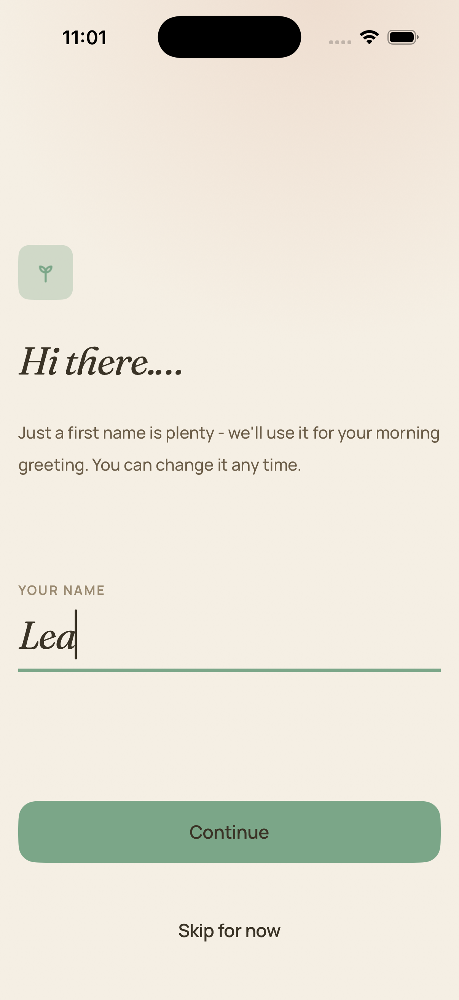
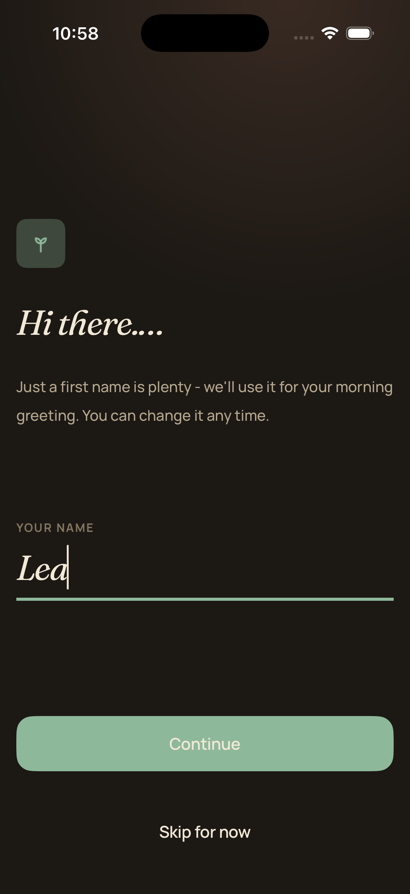
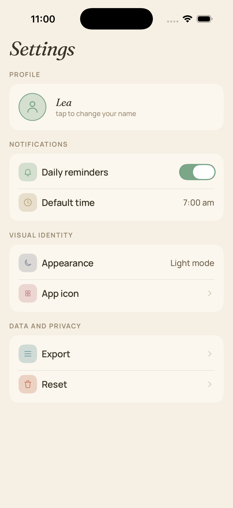
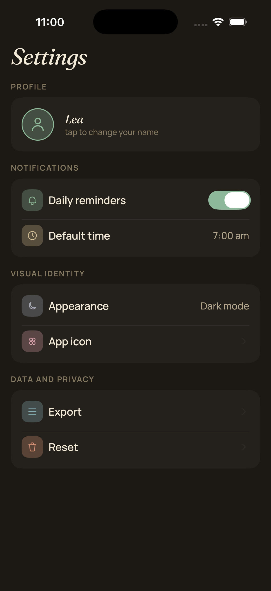

# Perio

> 🚧 **Work in Progress** — This project is under active development. Features, architecture, and documentation are evolving.

**A gentle habit tracker for iOS.** Perio helps you keep up with recurring habits and periodic tasks — daily routines, weekly chores, monthly reminders — without the guilt. No streak shaming, no gamification pressure. Just a calm companion that helps you stay on rhythm.

---

## Why Perio?

Most habit trackers punish you for missing a day. Perio takes a different approach: it's a buddy, not a coach. Miss a day? That's fine — life happens. The schedule stays anchored to the calendar, not to your last completion. Open the app after a long day and it gently shows you what's on your plate, what you've done, and what can wait.

## Screenshots

<p align="center">
  
  
  
  
</p>

---

## Architecture

Perio follows **Clean Architecture + MVVM** with a clear modular separation enforced at the project level.

### Module Structure

```
Perio/
├── App/                        → Composition root, DI wiring, Coordinators
├── Modules/
│   ├── PerioDomain/            → Entities, Use Case protocols, Repository protocols
│   ├── PerioData/              → Concrete repositories, persistence, UserDefaults
│   ├── PerioPresentation/      → SwiftUI Views, ViewModels, UI logic
│   └── PerioDesignSystem/      → Colors, typography, icons, reusable components
```

### Dependency Direction

```
App → Presentation → Domain ← Data
                        ↑
                  DesignSystem
```

- **PerioDomain** depends on nothing. Pure Swift — entities, protocols, business logic.
- **PerioData** depends on PerioDomain. Implements repository protocols with concrete persistence (SwiftData, UserDefaults).
- **PerioPresentation** depends on PerioDomain and PerioDesignSystem. Views and ViewModels never see the Data layer.
- **PerioDesignSystem** depends on nothing. Leaf module with colors, fonts, icons, and reusable UI components.
- **App** imports all modules and wires everything together. DI registration, Coordinators, and root-level app state live here.

### Key Patterns

- **Dependency Injection** via a custom lightweight DI container (`DIRegistry`) with lazy resolution and singleton caching. No third-party DI frameworks.
- **Protocol-driven ViewModels** using Swift's `Observable` protocol conformance. Views depend on ViewModel abstractions, never concrete implementations.
- **Reactive data flow** with `AsyncStream` for value observation across layers. Domain protocols expose `AsyncStream`, Data layer manages continuations internally with multi-subscriber support.
- **SwiftUI `.task` lifecycle management** — Views drive async subscriptions via `.task`, SwiftUI handles cancellation automatically. No manual `Task` cleanup or `deinit` gymnastics.

---

## Tech Stack

| Layer              | Technology                                                |
| ------------------ | --------------------------------------------------------- |
| UI                 | SwiftUI (iOS 17+)                                        |
| Observation        | `@Observable` macro, `AsyncStream`                        |
| Persistence        | SwiftData (habits), UserDefaults (preferences)            |
| Concurrency        | Swift Concurrency (async/await, `AsyncStream`, `@MainActor`) |
| Project Generation | Tuist                                                     |
| Modularization     | Swift Package Manager (local packages via Tuist)          |
| Linting            | SwiftLint (Homebrew + build phase script)                 |
| Resource Synthesis | Tuist resource synthesizers (assets, strings, fonts)      |
| Design System      | Custom module with asset catalogs and typed accessors     |
| DI                 | Custom container with lazy resolution                     |
| Minimum Target     | iOS 17                                                    |

---

## Design Philosophy

Perio's UI follows a **zen, minimalist, warm** aesthetic.

- **Warm color palette** — cream backgrounds, sage green accents, soft charcoal text. Never pure white or pure black.
- **Serif + sans-serif pairing** — display headings in a friendly serif, body text in Manrope.
- **Gentle animations** — spring animations with soft damping, fades at 300-500ms. Completions feel like a breath, not a celebration.
- **Accessible by default** — VoiceOver labels, Dynamic Type support, reduce-motion alternatives.

---

## Domain Model

Every item in Perio is a **recurring habit** anchored to a fixed cadence. The calendar drives the schedule, not the user's behavior.

### Recurrence Types

- **Daily** — every day
- **Weekly** — specific days of the week (e.g., Mon/Wed/Fri)
- **Monthly** — specific day of the month (e.g., the 15th)
- **Custom** — every N days/weeks (e.g., every 3 days)

### Core Logic

A `RecurrenceCalculator` provides pure functions for date math:

- `nextDueDate` — next expected occurrence based on recurrence rule
- `isOverdue` / `isDueToday` — scheduling queries against a reference date
- `currentStreak` / `longestStreak` — consecutive completed occurrences
- `completionRate` — percentage of expected occurrences met in a date range

All functions are calendar-aware, timezone-safe, and extensively unit tested.

---

## Screens

| Screen             | Description                                                                 |
| ------------------ | --------------------------------------------------------------------------- |
| **Today**          | Daily view — due items, overdue items, completion progress                  |
| **All Habits**     | Full library grouped by recurrence type, drag-to-reorder                   |
| **Habit Detail**   | Stats, streak heatmap calendar, completion history                         |
| **Create / Edit**  | Title, icon picker, color picker, recurrence selector, reminder time       |
| **Stats**          | Cross-habit insights — completion charts, streak trends, consistency       |
| **Settings**       | Appearance, notifications, tone of voice, export/reset                     |

---

## Getting Started

### Prerequisites

- Xcode 16+
- [Tuist](https://tuist.io) installed (`curl -Ls https://install.tuist.io | bash`)
- SwiftLint installed via Homebrew (`brew install swiftlint`)

### Setup

```bash
git clone https://github.com/Urielbp/Perio.git
cd Perio
tuist install
tuist generate
```

Open the generated `Perio.xcworkspace` in Xcode and run.

---

## Project Status

This is a portfolio project built to demonstrate modern iOS development practices. It is under active development.

### What's Done

- [x] Project setup with Tuist and modular SPM structure
- [x] Design system module (colors, typography, icons, reusable components)
- [x] Settings screen with appearance mode (light/dark/system)
- [x] Onboarding screen
- [x] Clean Architecture layers wired end-to-end
- [x] Custom DI container with lazy resolution and singleton caching
- [x] Reactive preference observation with AsyncStream
- [x] Resource synthesis via Tuist (assets, localized strings, fonts)
- [x] SwiftLint integration via Homebrew build phase

### What's Next

- [ ] Core domain logic (RecurrenceCalculator, streak engine)
- [ ] Today screen with due/overdue items
- [ ] Create/Edit habit flow
- [ ] SwiftData persistence for habits and completions
- [ ] Notification scheduling
- [ ] Animated completion rings and streak heatmap
- [ ] WidgetKit integration
- [ ] Unit and snapshot tests
- [ ] CI pipeline

---

## License

This project is licensed under the
[Creative Commons Attribution-NonCommercial-ShareAlike 4.0 International License](https://creativecommons.org/licenses/by-nc-sa/4.0/).

You are free to study, modify, and share this code for non-commercial and educational purposes,
as long as you credit the original author and distribute any derivatives under the same license.

Commercial use — including publishing to the App Store — is not permitted.

For more information, check the [license](https://github.com/Urielbp/Perio/LICENSE.md).

### Third-Party Licenses

- **Fraunces** and **Manrope** fonts are licensed under the
  [SIL Open Font License 1.1](https://scripts.sil.org/OFL).
